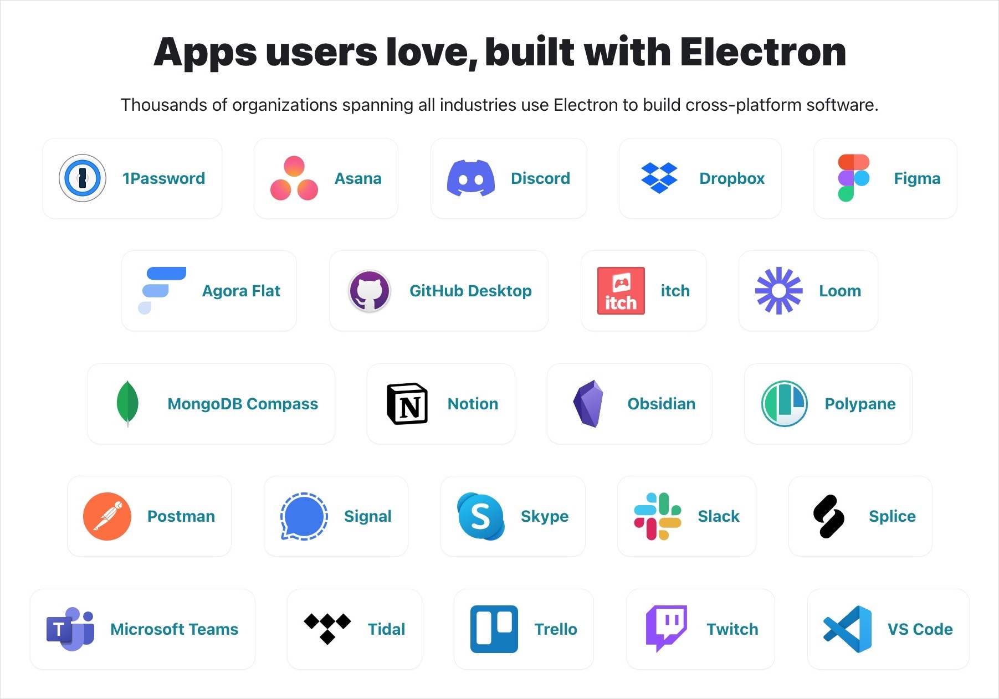
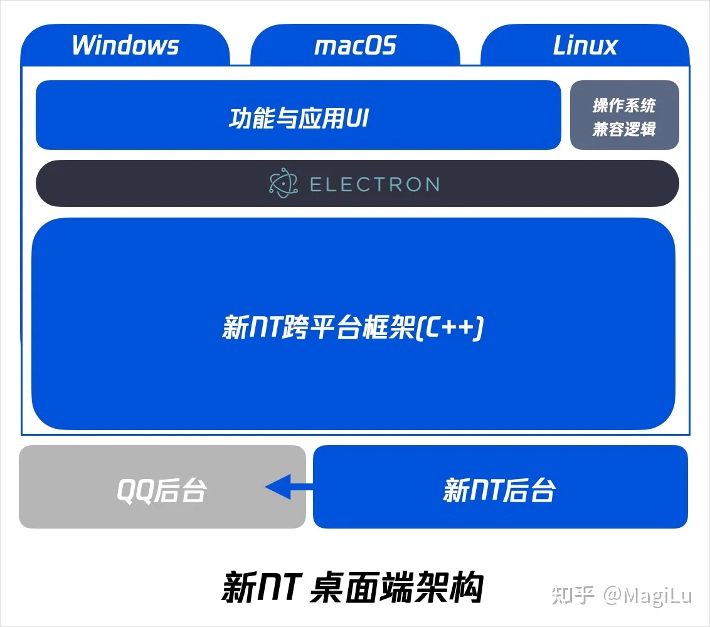
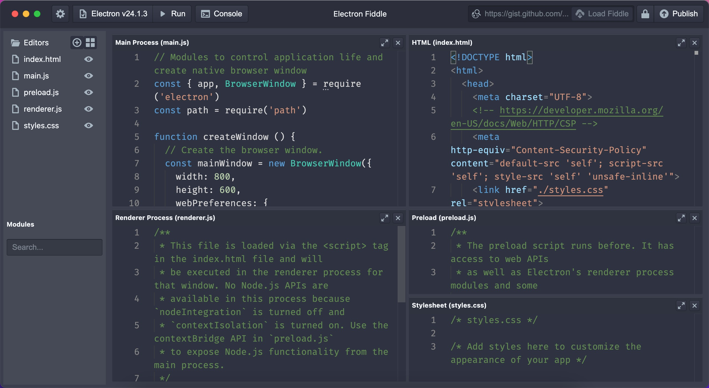
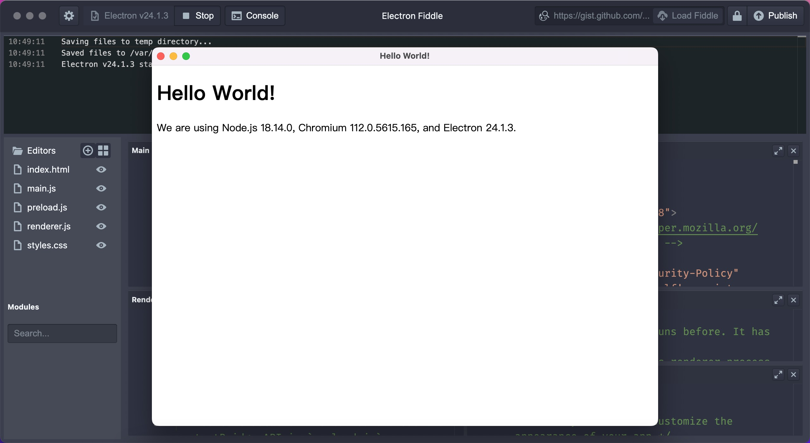
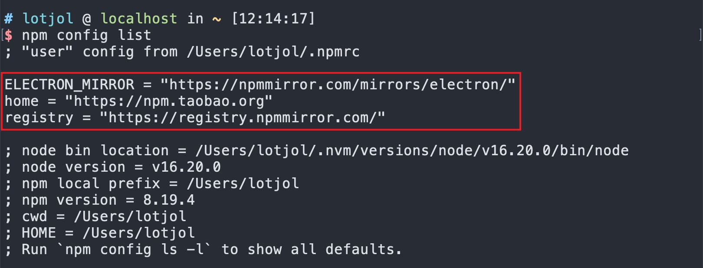

# 一、开始上手

> 在这一小节对 Eelectron 有个大概的了解

## 1.1 介绍

**Electron**（原名为**Atom Shell**）是 **GitHub** 开发的一个开源框架。它通过使用 **Node.js** 和 **Chromium** 的渲染引擎完成**跨平台的桌面** GUI 应用程序的开发。Electron 现已被多个开源 Web 应用程序用于前端与后端的开发，著名项目包括 GitHub 的 Atom 、微软的 Visual Studio Code 和腾讯的 QQNT。

**Electron** 并不是一门新的技术，自 2013 年开始至今已有 10 年历史了，最初是由 GitHub 团队开发，现由 OpenJS 基金会负责维护。



[腾讯基于 Electron 技术的 Windows 版 QQ 内测版本预计 2023 年推出，该版本有哪些新功能？](https://www.zhihu.com/question/570447541/answer/2791939780?utm_id=0)



**以上内容仅需有个印象即可，主旨意思就是 Elelectron 很牛！！！！**

## 1.2 快速体验

**Electron Fiddle** 是 [Electron 官方](https://www.electronjs.org/zh/)提供的快速演示或体验 Electron 功能的工具，在 Electron Fiddle 内部集成了 Electron 的开发环境。通过该工具可以让开发者快速体验 Electron 的某些新特性，对于初学者来说可以快速建立对 Electron 的认识。

1. 安装 Electron Fiddle

Electron Fiddle [下载地址](https://www.electronjs.org/zh/fiddle)，下载符合各自操作系统的版本，正常安装即可。



打开 Electron Fiddle 后可以看到自动创建了 Electron 项目的模板，左侧是文件列表，右侧是文件的内容，可以简单的看到 **Electron 的项目代码是由 HTML、CSS、JavaScript 构成。**

2. 运行 Electron 项目

点击 Electron Fiddle 工具栏中的 【Run】按钮：



3. 修改 Electron 项目代码

- index.html 是项目的布局结构
- style.css 是项目布局样式
- renderer.js 是运行在浏览器环境
- preload.js 是运行在浏览器环境
- main.js 是运行在 Node 环境

关于 proload.js 和 main.js 的作用在后面会详细介绍，当前需要体会到 index.html、style.css 和 renderer.js 的作用。

注：默认情况下每次打开 Electron Fiddle 都会重新的生成项目模板，代码模板可以以链接形式进行分享。

**上面的内容的主旨内容是要知道 Electron 项目的代码使用的是 HTML、CSS、JavasScript 和 Node.js 相关的技术。**

## 1.3 从零开始

从零开始带大家创建一个 Electron 的项目，让大家对 Electron 的技术架构有个基本的认识。

1. 项目结构，Electron 项目至少需要 3 个文件
   - index.html
   - package.json（npm init -y）
   - main.js （习惯叫做 main.js）

创建一个空白的目录，然后分别创建上述 3 个文件

2. 安装 electron 依赖：

```bash
# 安装 electron
npm install electron --save-dev
```

注：在安装 electron 的过程中会根据开发者的当前的操作系统去下载 electron 的二进制包，多数情况下由于网络的原因会导致下载失败，对应的解决方案是指定国内的镜像，如[淘宝镜像](https://npmmirror.com/)。

```bash
# 指定 npm 仓库地址
npm config set registry https://registry.npmmirror.com
# 指定 electron 二进制包的镜像地址
npm config set ELECTRON_MIRROR="https://npmmirror.com/mirrors/electron/"
```

检测 npm 仓库和 electron 镜像地址是否设置成功

```bash
npm config list
```



3. 启动项目

通过安装好的 electron 来启动项目，添加启动项目的脚本：

```json
{
	...
  "scripts": {
    "start": "electron ."
  },
  ...
}

```

在执行 `npm start` 时，electron 会去执行 `package.json` 中指定的入口：

```json
{
  "name": "electron-demo",
  "version": "1.0.0",
  "description": "",
  "main": "main.js",
  "scripts": {
    "start": "electron .",
    "test": "echo \"Error: no test specified\" && exit 1"
  },
  "keywords": [],
  "author": "",
  "license": "ISC",
  "devDependencies": {
    "electron": "^24.3.0"
  }
}
```

4. 开始编码

在 main.js 中启动一个应用窗口并加载 index.html 页面：

```javascript
// main.js
const { app, BrowserWindow } = require("electron");

function createWindow() {
  // 应用窗口实例
  const win = new BrowserWindow();
  // 加载 index.html
  win.loadFile("./index.html");
}

// 监听 app 的 ready 事件（生命周期）
app.on("ready", () => {
  createWindow();
});
```

至此最基本的 Electron 项目就创建好了。

