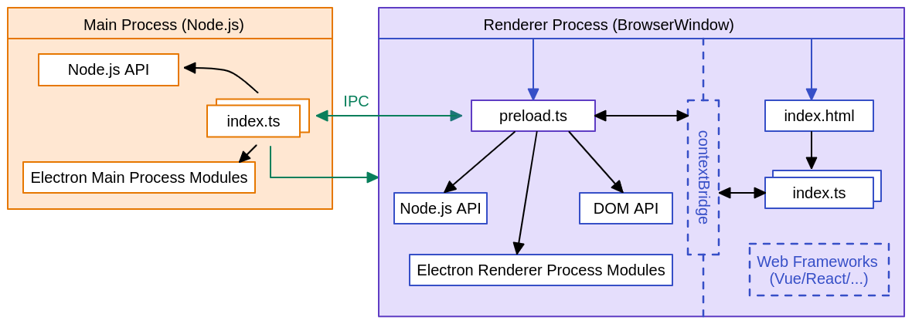

# 二、基本概念

> 在这一小节对 Eelectron 的技术架构有个基本的认识

Electron 是内部集成了两个运行环境：

- Nodejs 环境，称为主进程（ Main Process ）
- Chromium 环境，称为渲染器进程（Renderer Process）



可以理解成在主进程中就是在写 Nodejs 的代码，在渲染器进程中是在写网页相关的代码（如 HTML、CSS、JavaScript 等）。

**主进程**对应的代码文件是 `main.js` 以及将来通过 `require` 导入到 `main.js` 中的模块

**渲染器进程**对应的代码文件是 `index.html` 以及将来通过 `link`、`script` 、`img`引入到页面中的代码或资源

## 2.1 主进程

主进程是运行在 Nodejs 环境中的，因此可以调用 Nodejs 的各个 API，如 `http`、`path`、`url`、`file` 等系统模块，也可以在导入 Electron 后使用 Electron 模块提供的 API。

先介绍 Electron 中 `app`、`BroswerWindow` 的基本用法：

```javascript
// 导入相应的功能接口
const { app, BrowserWindow } = require("electron");
function createWindow() {
  // 创建应用窗口实例
  const win = new BrowserWindow({
    width: 1200,
    height: 800,
    titleBarStyle: "hidden",
    titleBarOverlay: true,
  });
  // 加载 index.html
  win.loadFile("index.html");
  // 加载网络地址
  // win.loadURL('http://static-serve.botue.com/electron/index.html')
}
// 监听 app 的 ready 事件（生命周期）
app.on("ready", () => {
  createWindow();
});
// 监听 app 的 activate 事件
app.on("activate", () => {
  console.log("Electron 应用被激活了...");
});
```

- BroswerWindow 用来创建并按制浏览器窗口
  - width/heigh 指定窗口的大小
  - titleBarStyle 窗口标题栏样式
  - titleBarOverlay 定义 windows 的标题栏
  - loadFile 实例方法，加载本地 html 文件
  - loadURL 实例方法，加载网络地址
- app 控制应用程序的事件生命周期
  - ready 在 Electron 完成初始化时触发该生命周期
  - active 在 Eelectron 被激活（前台运行）时触发该生命周期

注：修改了主进程的代码后需要重新启动应用。

## 2.2 渲染器进程

在对上述的概念有了基本印象后，我们来相对大家比较熟悉的渲染器进程：

```html
<!DOCTYPE html>
<html lang="en">
  <head>
    <meta charset="UTF-8" />
    <meta http-equiv="X-UA-Compatible" content="IE=edge" />
    <meta name="viewport" content="width=device-width, initial-scale=1.0" />
    <title>Hello World!</title>
    <link rel="stylesheet" href="./style.css" />
  </head>
  <body>
    <h1 class="message">Hello World!</h1>
    <button class="button">打个招呼</button>
    <script src="./renderer.js"></script>
  </body>
</html>
```

在 `index.html` 中引入了 `style.css` 和 `renderer.js` 两个文件

```css
/** style.css **/
body {
  padding: 10px 20px;
}
h1 {
  font-size: 36px;
  color: #333;
}
button {
  height: 36px;
  padding: 0 15px;
  border-radius: 4px;
  cursor: pointer;
  background-color: #42b883;
  color: #fff;
  border: none;
}
button:active,
button:hover {
  background-color: #33a06f;
}
```

```javascript
// renderer.js
// 获取 DOM 节点
const button = document.querySelector(".button");
const message = document.querySelector(".message");
// 监听用户点击事件
button.addEventListener("click", () => {
  // 修改 DOM 的内容
  message.innerHTML = "大家好，快来黑马学IT!";
});
```

注：修改了渲染器进程的代码后使用快捷键 Commond + R 或者 Ctrl + R 刷新页面。

## 2.3 预加载脚本

主进程与渲染进程之间是彼此隔离的，相互之间无法直接进行通信，通过**预加载脚本**能够实现主进程与渲染进程间的通信，预加载脚本本质上就是一个 `.js` 文件，在创建应用窗口时指定：

```javascript
// 导入相应的功能接口
const { app, BrowserWindow } = require("electron");
function createWindow() {
  // 创建应用窗口实例
  const win = new BrowserWindow({
    width: 1200,
    height: 800,
    titleBarStyle: "hidden",
    titleBarOverlay: true,
    webPreferences: {
      preload: "./preload.js",
    },
  });
  // 加载 index.html
  win.loadFile("index.html");
}
```

预加载脚本可以实现两个常用的功能：

1. 扩展 window 对象，为其添加一些属性或方法

```javascript
// preload.js
const { contextBridge } = require("electron");
// 为 window 扩展了 test 属性
contextBridge.exposeInMainWorld("test", "window.test");
// 为 window 扩展一些属性或方法
contextBridge.exposeInMainWorld("electronAPI", {
  // 平台的名称
  platform: process.platform,
  // 系统版本号
  getVersions() {
    return process.versions;
  },
});
```

2. 进程间通信

由渲染进程向主进程发起通信的实现步骤如下：

- ipcMain 处理主进程的通信，通过 `handle` 定义一个处理方法

```javascript
// main.js
// 导入相应的功能接口
const { app, BrowserWindow, ipcMain } = require("electron");

// 省略之前完成的代码...

// 注册一个名称 handle-message 处理方法
ipMain.handle("handle-message", (_ev, message) => {
  console.log("I have received your message: " + message);
  // 将处理结果返回给渲染进程
  return "Hi, your message is: " + message;
});
```

- ipcRender 处理渲染器进程的通信，通过 `invoke` 调用主进程定义好的处理方法

```javascript
// preload.js
const { contextBridge, ipcRenderer } = require("electron");
// 为 window 扩展一些属性或方法
contextBridge.exposeInMainWorld("electronAPI", {
  // ...
  // 发送用户的消息
  sendMessage(message) {
    // 调用主进程中的方法并传参
    return ipcRenderer.invoke("handle-message", message);
  },
});
```

```javascript
// renderer.js
// 获取 DOM 节点
const button = document.querySelector(".button");
const message = document.querySelector(".message");
// 监听用户点击事件
button.addEventListener("click", async () => {
  // 修改 DOM 的内容
  message.innerHTML = "大家好，快来黑马学编程...";
  // 获取主进程处理的结果
  const result = await window.electronAPI.sendMessage("测试消息发送...");
});
```

## 2.4 打包应用

当所有功能开完成毕后，将 Electron 打包成不同平台的应用，Electron 提供了打包的工具 [Electron Forge](https://www.electronforge.io/)，但实际应用中大家用的比较多的是 [electron-builder](https://www.electron.build/)，接下来我们介绍的是 electron-builder 的使用：

1. 安装 electron-builder

   ```bash
   npm install electron-builder --save-dev
   ```

2. 配置脚本

   ```json
   {
     ...
     "scripts": {
       "start": "electron .",
       "build:mac": "electron-builder --mac",
       "build:win": "electron-builder --win"
     },
     ...
   }
   ```

3. 生成图标

   在项目根目录中创建 `build` 目录，再准备一张 png 格式的图片，将其命名为 `icon.png` 放到 `build`中，关于图标的详细说明[参见文档](https://www.electron.build/icons)。

4. 执行打包任务

   ```bash
   # 打包 mac 系统的应用
   npm run build:mac
   # 或打包 windows 系统的应用
   npm run build:win
   ```

   在打包的过程中需要下载相应平台的工具包，因此需要稳定的网络环境，大家要耐心待待。

   **注：Windows 系统开发时不能打包 Mac 的应用。**

